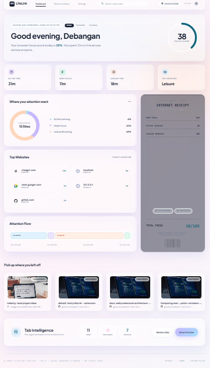
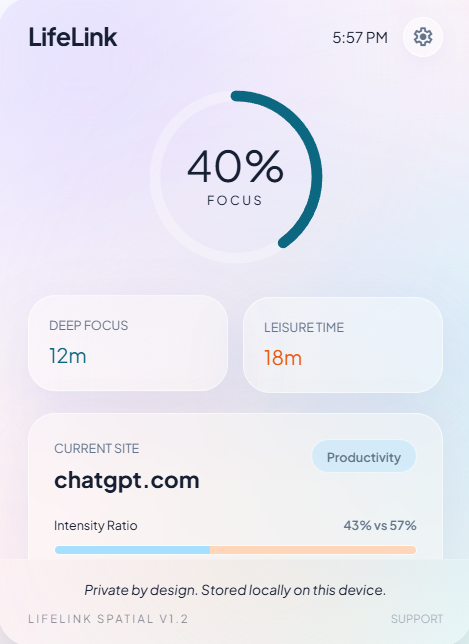
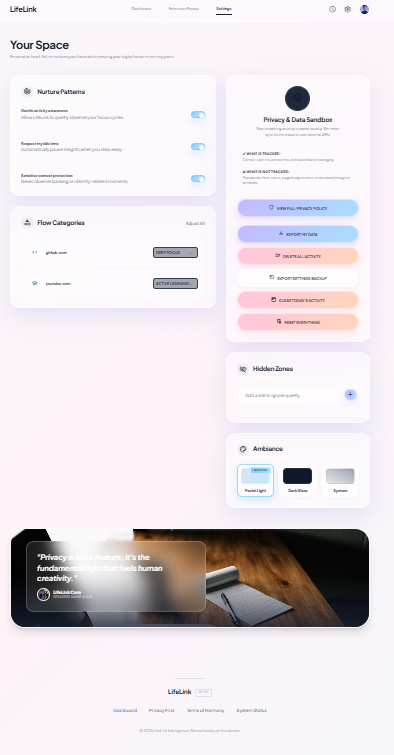

# LifeLink

Privacy-first browser intelligence dashboard.

---

## 3. Overview

LifeLink is a local-first, privacy-respecting Chrome extension that replaces your browser's default New Tab page with a calm, pastel liquid-glass dashboard. Designed with modern glassmorphism aesthetics and smooth micro-animations, LifeLink tracks your active browser usage locally and translates it into real-time attention insights—including focus scores, category breakdowns, daily timeline flows, and beautiful, print-ready digital "Internet Receipts" of your attention.

---

## 4. Problem Statement

Modern users spend hours inside web browsers every day, yet we rarely have a clear, objective understanding of where our attention actually goes. Existing productivity trackers either require clunky manual logging, lack visual feedback, or worse, upload raw browsing histories and URLs to cloud servers for indexing. This creates a severe privacy tradeoff between wanting digital self-awareness and keeping personal web activity confidential.

---

## 5. Key Features

*   **⏱️ Live Active Tab Tracking**: Service-worker-based tracking of active tabs with millisecond precision, filtering out system URLs and background tabs.
*   **🎯 Focus Score**: A dynamically calculated score evaluating your cognitive balance based on time spent in deep work versus active learning and leisure.
*   **🧾 Internet Receipt**: A printable, retro-modern receipt card rendering your attention metrics as a physical ticket—perfect for digital receipts or personal archiving.
*   **🌐 Top Websites**: Auto-aggregates and ranks your most visited domains by total duration, pulling local favicons.
*   **📈 Attention Flow Timeline**: A clean, segment-blocked hourly visualizer showing your online intensity and breaks throughout the day.
*   **🗂️ Category Breakdown**: Interactive visualizations grouping domain logs into **Deep Focus**, **Active Learning**, and **Leisure Browsing**.
*   **🧠 Tab Intelligence**: Detects duplicate tabs and offers single-click background optimizations like "Close Duplicates" and "Smart Archive".
*   **⚡ Popup Quick Stats**: A compact extension popup interface displaying current-tab classification, active status, and toggleable tracking buttons.
*   **⚙️ Settings Page**: Full control over ignored zones, blacklist additions, custom categorization rules, and theme options (Pastel Light, Midnight Dark Glass, System).
*   **📜 Terms & Privacy Pages**: Access clear, locally rendered documentation of policies and extension behaviors directly from the dashboard.
*   **🏥 System Status Page**: Diagnostic ledger verifying service worker health, storage limits, and live storage event listeners.
*   **💾 Export/Delete Local Data**: Instant local JSON backups or full sandbox resets to maintain total data custody.
*   **🔒 Local-First Privacy**: Operates fully on-device without cloud dependencies, external telemetry, or remote server requests.

---
## Screenshots

### Dashboard


### Popup


### Settings


## 6. Architecture

LifeLink is structured as an isolated local-first application within the browser context. All state syncs reactively across different extension documents via browser storage hooks.

```text
+--------------------------------------------------------+
|                     Chrome Browser                     |
+--------------------------------------------------------+
                           │
                           ▼
+--------------------------------------------------------+
|               Background Service Worker                |
|                    (background.ts)                     |
+--------------------------------------------------------+
                           │ (Writes logs)
                           ▼
+--------------------------------------------------------+
|                 chrome.storage.local                   |
|                   (Local Sandbox)                      |
+--------------------------------------------------------+
                           │ (Reads data)
                           ▼
+--------------------------------------------------------+
|                    Analytics Layer                     |
|               (activityAnalytics.ts)                   |
+--------------------------------------------------------+
                           │ (Calculates stats)
                           ▼
+--------------------------------------------------------+
|                        UI Layer                        |
|       (Dashboard / Popup / Settings / Status)          |
+--------------------------------------------------------+
```

### Layer Explanations:
*   **Background Service Worker (`background.ts`)**: The core observer. It listens to active tab activations, URL updates, window focus shifts, and system idle state changes, compiling them into discrete sessions.
*   **Chrome Local Storage (`chrome.storage.local`)**: The local database sandbox. It stores serialized session lists and user preferences.
*   **Analytics Layer (`activityAnalytics.ts`)**: Takes raw session arrays, filters short visits (<5s), merges consecutive logs on identical domains within a 60-second gap, and calculates totals, ranking, and the overall focus score.
*   **UI Layer (React & Tailwind)**: Consists of the New Tab Dashboard, Extension Popup, Settings panel, Status ledger, and terms/privacy documents. It reads storage and renders the views with reactive state sync.

---

## 7. System Flow

```text
User browses a website 
   │
   ▼
Active tab detected & classified by Background Worker
   │
   ▼
Tracking session starts (startTime recorded)
   │
   ▼
Tab switch / Idle state / Window focus lost
   │
   ▼
Session ends (endTime recorded)
   │
   ▼
Session saved to chrome.storage.local
   │
   ▼
New Tab Dashboard reads storage, runs analytics, and renders insights
```

---

## 8. Data Flow

```text
[chrome.tabs / chrome.windows / chrome.idle APIs]
                       │
                       ▼
               [background.ts] (Filters & compiles durations)
                       │
                       ▼
            [ActivitySession Object]
                       │
                       ▼
            [chrome.storage.local]
                       │
                       ▼
             [analytics utilities] (Merges & parses slots)
                       │
                       ▼
                  [React UI] (Reactive state render)
```

---

## 9. Storage Model

### `ActivitySession` Data Structure
Stores individual browsing logs in `chrome.storage.local['activitySessions']`:
```typescript
export interface ActivitySession {
  id: string;          // Cryptographically unique UUID
  url: string;         // Full URL of the visited page
  domain: string;      // Parsed clean domain (e.g. github.com)
  title: string;       // Tab title at load time
  category: string;    // Classified category (Deep Work, Learning, Casual)
  startTime: number;   // Epoch timestamp representing session start
  endTime: number;     // Epoch timestamp representing session end
  durationMs: number;  // Session duration (endTime - startTime)
  date: string;        // Local date string (YYYY-MM-DD) for fast queries
  source?: string;     // Optional metadata tag (e.g., 'debug')
}
```

### `LifeLinkSettings` Data Structure
Stores configuration rules in `chrome.storage.local['lifelinkSettings']`:
```typescript
export interface LifeLinkSettings {
  trackingEnabled: boolean;       // Overall tracking active state
  isPaused: boolean;              // User-set pause override
  pauseWhenIdle: boolean;         // Check system idle to pause tracking
  ignoreSensitiveSites: boolean;  // Automatically ignore banking/sensitive keywords
  blacklistedDomains: string[];   // User-defined blacklist domains
}
```

---

## 10. Privacy-First Design

*   **No Authentication Required**: LifeLink does not require logins, email signups, or profiles.
*   **Zero Remote Calls**: The extension requests no remote host permissions and conducts no network telemetry.
*   **Encrypted Sandbox**: All data is contained within the local browser sandbox (`chrome.storage.local`).
*   **Ignored Content**: The extension only reads metadata (URL, Title, Duration). It cannot access webpage contents, form fields, inputs, cookies, password managers, or private (incognito) windows.
*   **Total Data Custody**: You can export your full database history as a JSON backup or permanently purge all local data instantly.

---

## 11. Tech Stack

*   **Framework**: [React 18](https://react.dev/)
*   **Language**: [TypeScript](https://www.typescriptlang.org/)
*   **Build Tool**: [Vite](https://vite.dev/)
*   **Styling**: [Tailwind CSS v3](https://tailwindcss.com/)
*   **State & Routing**: Standard React Hooks & Hash Routing / Page Overrides
*   **Iconography**: Google Material Symbols & Lucide React
*   **APIs Used**:
    *   `chrome.tabs` (Tab monitoring and query)
    *   `chrome.storage` (Sandboxed local persistence)
    *   `chrome.windows` (Window focus detection)
    *   `chrome.idle` (System idle and lock observer)
    *   `chrome.alarms` (Scheduled daily pruning)

---

## 12. Project Structure

```text
Lifelink/
├── dist/                          # Packaged extension folder
├── public/                        # Static extension assets
│   ├── icon.png                   # High-res logo (512x512)
│   ├── icon16.png                 # Extension toolbar icon
│   ├── icon48.png                 # Extensions management icon
│   ├── icon128.png                # Chrome Web Store icon
│   └── manifest.json              # Extension Manifest V3 configuration
├── src/
│   ├── background/
│   │   └── background.ts          # Core service worker observer
│   ├── components/
│   │   ├── CategoryChart.tsx      # Recharts categories breakdown chart
│   │   ├── ContinueCard.tsx       # "Continue reading" shortcut cards
│   │   ├── GlassCard.tsx          # Glassmorphic card container wrapper
│   │   ├── IntelligenceCard.tsx   # Tab optimization control card
│   │   ├── Navbar.tsx             # Main dashboard header navigation
│   │   ├── ReceiptCard.tsx        # Printable focus receipt card
│   │   ├── ScoreCard.tsx          # Score display circular progress ring
│   │   ├── StatsCard.tsx          # Active stats metrics card
│   │   └── Timeline.tsx           # Hour-slot attention flow bar chart
│   ├── lib/
│   │   ├── activityAnalytics.ts   # Data processing and analytics logic
│   │   └── categoryClassifier.ts  # Rules engine for domain categorizations
│   ├── pages/
│   │   ├── Dashboard.tsx          # Core dashboard (New Tab override)
│   │   ├── Popup.tsx              # Toolbar popover interface
│   │   ├── Privacy.tsx            # Full privacy documentation panel
│   │   ├── Settings.tsx           # Preferences, Rules, and Blacklist editor
│   │   ├── Status.tsx             # Telemetry Diagnostic Ledger
│   │   └── Terms.tsx              # Terms of Harmony document panel
│   ├── styles/
│   │   ├── glass.css              # Custom blur and glass modifiers
│   │   └── theme.ts               # Theme application utility
│   ├── types/
│   │   └── dashboard.ts           # Shared TypeScript interfaces
│   ├── utils/
│   │   └── storage.ts             # Storage write/dispatch synchronizer
│   ├── App.tsx                    # Main Routing wrapper
│   ├── index.css                  # Tailwinds directives and custom animations
│   └── main.tsx                   # Mounting entrypoint
├── package.json                   # Dependencies and build targets
├── tsconfig.json                  # Compiler options
├── vite.config.ts                 # UI compilation config
└── vite.config.background.ts      # Background script compilation config
```

---

## 13. Local Installation

To load and run LifeLink locally on your machine:

1.  **Clone the Repository**:
    ```bash
    git clone https://github.com/YOUR_USERNAME/YOUR_REPOSITORY_NAME.git
    cd Lifelink
    ```
2.  **Install Project Dependencies**:
    ```bash
    npm install
    ```
3.  **Compile & Bundle Assets**:
    ```bash
    npm run build
    ```
4.  **Load into Chrome**:
    *   Open Google Chrome and navigate to `chrome://extensions/`.
    *   Toggle **Developer mode** in the top-right corner.
    *   Click the **Load unpacked** button in the top-left.
    *   Select the **`dist`** directory in the root of the project.

---

## 14. Chrome Extension Build Setup

When you run `npm run build`, Vite generates a bundled output in the `/dist` directory. The Chrome Web Store pack must contain:
*   `manifest.json`: Configuration mapping permissions and overrides.
*   `newtab.html`, `popup.html`, `options.html`, `privacy.html`, `status.html`, `terms.html`: HTML document roots.
*   `background.js`: Compiled ES-module worker.
*   `assets/`: Compiled and minified JS modules and CSS files.
*   `icon16.png`, `icon48.png`, `icon128.png`, `icon.png`: Resized PNG logos.

---

## 15. Permissions

LifeLink uses a minimal, strictly justified permission footprint:
*   `tabs`: Enables querying the active URL, tab ID, and tab title for live tracking and categorizations.
*   `storage`: Enables local reading and writing of logs and configuration settings.
*   `idle`: Queries system inactivity status to automatically pause observers when you step away.
*   `alarms`: Manages a daily clean-up task to prune logs older than 90 days.

---

## 16. Screens / Pages

*   **New Tab Dashboard**: The main entry point. Houses category breakdown charts, hourly timeline graphs, rank lists, and the printable Attention Receipt.
*   **Extension Popup**: Quick-action tool window to monitor active session categorization, view daily active totals, and pause observers.
*   **Settings Page**: The configuration hub. Contains the hidden zones domain editor, category rule assignments, dark glass theme selectors, and database backups.
*   **Terms Page**: Outlines terms of service and usage conditions.
*   **System Status Page**: Developer diagnostics showing database session counts, latest log records, worker connections, and state listener checklists.

---

## 17. Product Readiness Checklist

*   [x] **Manifest V3**: Compliant configuration containing only required permission hooks.
*   [x] **Live Tracking**: Event handlers listening to tab activations and URL swaps.
*   [x] **Local Storage**: Data persists in sandbox storage.
*   [x] **Real Dashboard Data**: Zero hardcoded layouts; charts adapt to local browsing history.
*   [x] **Popup**: Synchronized toggle buttons and duration hooks.
*   [x] **Settings**: Full category editing and custom blacklist zones.
*   [x] **Terms**: Clean documentation accessible on the client.
*   [x] **Status Page**: Diagnostic checklist checking worker performance.
*   [x] **CSP-safe**: No inline scripts; Vite outputs clean external module scripts.
*   [x] **No Remote Scripts**: Bundles all dependencies; zero CDN or remote library loading.
*   [x] **Local-First Privacy**: Operates fully offline without network access.
*   [x] **Export/Delete Data**: Action buttons trigger downloads or prompt database wipes.
*   [x] **GitHub Local Beta Ready**: Production build compiles with zero typescript warnings.

---

## 18. Roadmap

### v1.0 Local Beta (Current)
*   Background tab tracking and idle pause hooks.
*   New Tab dashboard with visual attention charts.
*   Custom categories and domain blacklists.
*   Interactive attention receipt card.

### v1.1 (Planned)
*   Enhanced category intelligence engine.
*   Weekly productivity comparison reports.
*   Improved tab state archiving logic.
*   Additional micro-interaction animations.

### v2.0 (Long-term)
*   Optional end-to-end encrypted backup.
*   Cross-device state synchronization (optional cloud account).

---

## 19. Known Limitations

*   **Local Beta State**: The project is in active beta and subject to local updates.
*   **No Cloud Sync**: History is lost if the extension is uninstalled or storage is cleared manually.
*   **Rule-based Category Detection**: Categorization relies on basic domain suffix matching and custom rule declarations.
*   **Active Tab Dependency**: Session tracking accuracy depends on active window focus, which can occasionally miscalculate background music/video streams if you remain active on another window.
*   **Store Release Pending**: Available as an unpacked local download; Chrome Web Store release is scheduled later.

---

## 20. Why No Authentication?

LifeLink is designed to respect your data ownership. Because the extension stores all data locally in the browser sandbox, there is no database server, no cloud storage, and therefore **no need for accounts, logins, or authentication**. We will only consider adding auth in the future if we introduce an *optional* cross-device encrypted cloud sync.

---

## 21. Developer

Built by **Debangan Roy**
*   *Frontend Developer · AI Builder · Video Editor · B.Tech CSE Student*

---

## 22. License

Currently in local beta as a portfolio/academic project. All rights reserved. License terms and open-source models will be established upon Chrome Web Store release.

---

## 23. Launch Statement

LifeLink is a privacy-first Chrome extension that turns active browser usage into a calm personal dashboard with focus score, attention flow, top websites, tab intelligence, and daily Internet Receipts — all stored locally on the user’s device.
